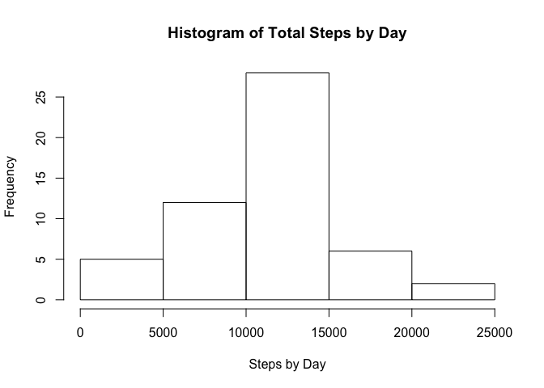
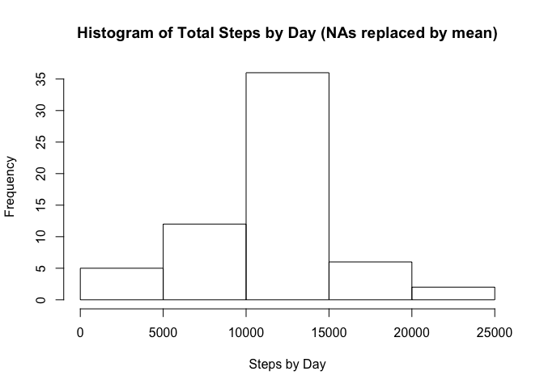
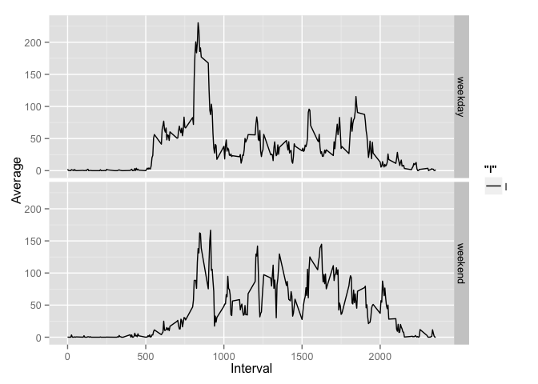

# Reproducible Research: Peer Assessment 1


## Loading and preprocessing the data

Let's read in the data, only keep complete cases and convert the date to a real date.


```r
library(lubridate)
rawActivity <- read.csv("activity.csv")
activity <- rawActivity[complete.cases(rawActivity),]
activity$date <- ymd(activity$date)
```

## What is mean total number of steps taken per day?

Here are the means for steps, listed by day.


```r
sumsByDate <- aggregate(activity$steps, list(activity$date), sum)
names(sumsByDate) <- c("Date", "Steps")
hist(sumsByDate$Steps, xlab="Steps by Day", ylab="Frequency", main="Histogram of Total Steps by Day")
```

 

```r
mean(sumsByDate$Steps)
```

```
## [1] 10766.19
```

```r
median(sumsByDate$Steps)
```

```
## [1] 10765
```

## What is the average daily activity pattern?


```r
averageByInterval <- aggregate(activity$steps, list(activity$interval), mean)
names(averageByInterval) <- c("Interval", "Average")
plot(averageByInterval$Interval, averageByInterval$Average, type="l", xlab="Interval", ylab="Average Steps")
```

 

Here is the interval with the highest average number of steps and what that average is

```r
sorted <- averageByInterval[order(-averageByInterval$Average),]
sorted[1,]
```

```
##     Interval  Average
## 104      835 206.1698
```


## Imputing missing values

Here are the total number of NAs in the activity set

```r
sum(!complete.cases(rawActivity))
```

```
## [1] 2304
```

Make a nice environment for looking up averages by interval


```r
intervalEnv <- new.env(hash=TRUE, parent=emptyenv())
for(i in 1:nrow(averageByInterval)) {
    row <- averageByInterval[i,]
    interval <- toString(row[1])
    steps <- as.numeric(row[2])
    intervalEnv[[interval]] <- steps
}
```

For my strategy, I am going to replace NA entries with the previously computed means. I put those means into internalEnv and when I encountered a NA value, I replace it with the corresponding value from intervalEnv.


```r
filled <- rawActivity
dayType <- toString(filled$date)

for(i in 1:nrow(filled)) {
  row <- filled[i,]
  theseSteps <- row[1]
  interval <- as.numeric(row[3])

  dayOfWeek <- weekdays(as.Date(row$date))
  
  if(dayOfWeek == "Saturday" || dayOfWeek == "Sunday") {
    dayType[i] <- "weekend"
  } else {
    dayType[i] <- "weekday"
  }
  
  if(is.na(theseSteps)) {
    row[1] = intervalEnv[[toString(interval)]]
    filled[i,] <- row
  }
}

filled$dayType <- dayType
filledSumsByDate <- aggregate(filled$steps, list(filled$date), sum)

names(filledSumsByDate) <- c("Date", "Steps")
hist(filledSumsByDate$Steps, xlab="Steps by Day", ylab="Frequency", main="Histogram of Total Steps by Day (NAs replaced by mean)")
```

 

```r
mean(filledSumsByDate$Steps)
```

```
## [1] 10766.19
```

```r
median(filledSumsByDate$Steps)
```

```
## [1] 10766.19
```

Note how the mean didn't change by replacing NAs with the mean and note that the median is now the mean.

## Are there differences in activity patterns between weekdays and weekends?


```r
library(ggplot2)
filledByInterval <- aggregate(filled$steps, list(filled$interval, filled$dayType), mean)
names(filledByInterval) <- c("Interval", "DayType", "Average")

gg <- ggplot(filledByInterval) + geom_line(aes(x=Interval, y=Average, linetype="l"))
gg + facet_grid(DayType ~ .)
```

 

Looks like steps flatten out a bit through the day on weekends. Maybe since folks don't have to go to work, they spread their morning walks throughout the day.
